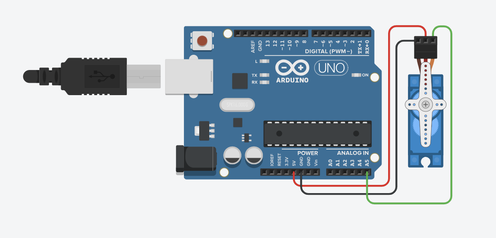
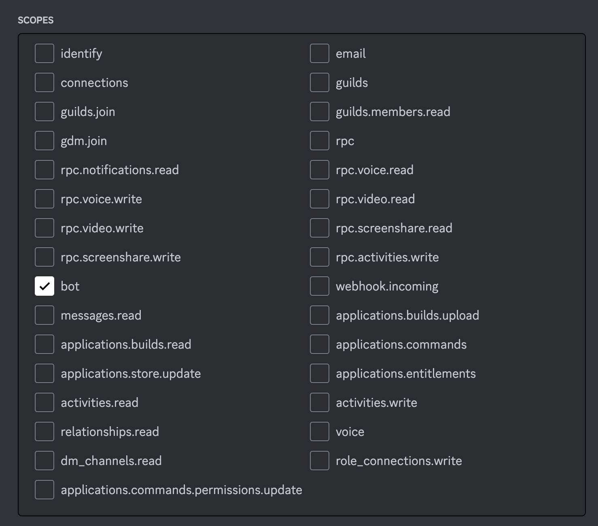

# Servo-go-brr
A fun lil project which lets the users on a discord server control a mini servo motor connected to an arduino

## Circuit Connections

## Discord Application Scopes Used

## Permissions
