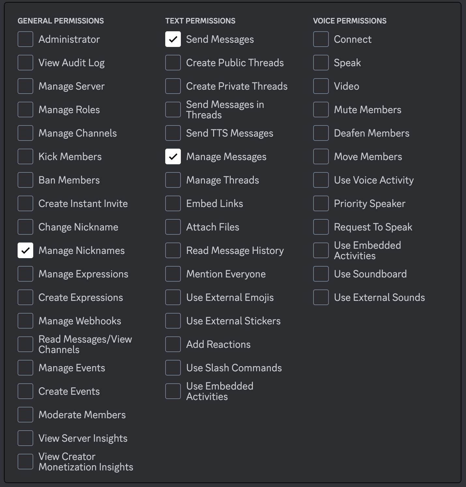

# Servo Go Brr

A fun lil project which lets bored users on a discord server control a mini servo motor using a discord bot.


## Circuit


Note: The one i used was an arduino nano, but UNO R3 works too.
## Setting up the Bot
Here's a quick guide for setting up the bot on the [discord developers page](https://discord.com/developers/applications).

 - Create a new application
 - Go to the 'Bot' Tab on the left menu.
 - Scroll down to Authorization Flow and make these changes (including Privileged Gateway Intents):
 
 - Now, go to the OAuth Tab on the menu, and click on URL Generator.
    - Scopes:
    

    - Permissions:
    

- There should be a URL at the bottom . Copy that, open it in a new tab and invite the bot to your server.

## Installing the API 

Discord API for python

```bash
  pip install discord
```
    
## Testing

Made a post on reddit to let people join the server and go nuts with the bot. Click on the link to see the bot in action.

-[Heres the reddit post](https://www.reddit.com/r/discordapp/comments/1657mrf/i_made_a_bot_which_lets_you_control_a_mini_servo/?utm_source=share&utm_medium=web2x&context=3)


## Acknowledgements

 - [Discord API Docs](https://discord.com/developers/docs/intro)
 - [Python + Arduino Serial Communication Guide](https://projecthub.arduino.cc/ansh2919/serial-communication-between-python-and-arduino-663756)
 


## Authors

- [@Hitesh1090](https://github.com/Hitesh1090)

